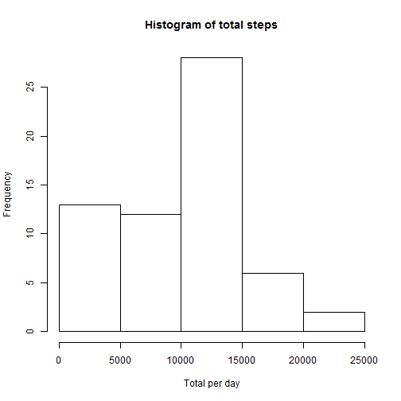
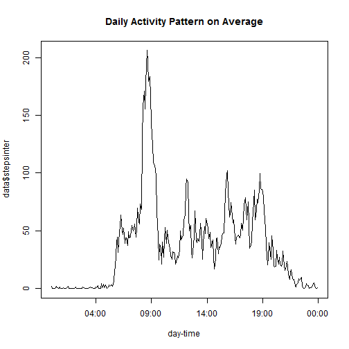
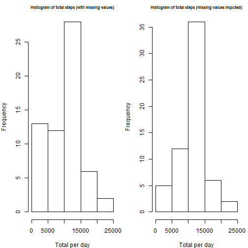
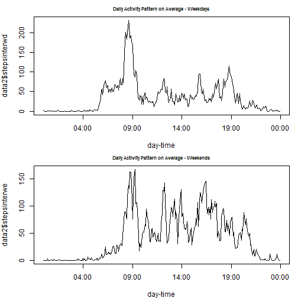

----------------------------------------------------------------------------------------------------

# Reproducible Research - Peer Assessment 1
----------------------------------------------------------------------------------------------------
**Data source:  Activity monitoring data**  
The data consists of two months of data from an anonymous individual collected during the months of October and November, 2012 and include the number of steps taken in 5 minute intervals each day.  
----------------------------------------------------------------------------------------------------

**Part 1 Loading and preprocessing the data**  

a) Load data to R by unzipping the zip file from a url.  
Use setInternet2 function since there is problem withexecuting download.file in rmarkdown.  


```r
setInternet2(use = TRUE)
temp <- tempfile()
url<-"https://d396qusza40orc.cloudfront.net/repdata%2Fdata%2Factivity.zip"
download.file(url, temp, mode="wb")
unzip(temp, "activity.csv")
activ <- read.table("activity.csv", sep=",", header=T)
unlink(temp)
```

b) Check the struture of the 'activ' dataset to check variable attributes.  
Also check the first anad last few observations of the data and number of missing data.  

```r
str(activ)
```

```
## 'data.frame':	17568 obs. of  3 variables:
##  $ steps   : int  NA NA NA NA NA NA NA NA NA NA ...
##  $ date    : Factor w/ 61 levels "2012-10-01","2012-10-02",..: 1 1 1 1 1 1 1 1 1 1 ...
##  $ interval: int  0 5 10 15 20 25 30 35 40 45 ...
```

```r
head(activ)
```

```
##   steps       date interval
## 1    NA 2012-10-01        0
## 2    NA 2012-10-01        5
## 3    NA 2012-10-01       10
## 4    NA 2012-10-01       15
## 5    NA 2012-10-01       20
## 6    NA 2012-10-01       25
```

```r
tail(activ)
```

```
##       steps       date interval
## 17563    NA 2012-11-30     2330
## 17564    NA 2012-11-30     2335
## 17565    NA 2012-11-30     2340
## 17566    NA 2012-11-30     2345
## 17567    NA 2012-11-30     2350
## 17568    NA 2012-11-30     2355
```

```r
colSums(is.na(activ))
```

```
##    steps     date interval 
##     2304        0        0
```
-----------------------------------------------------------------------------------------------------

**Part 2 What is the mean total number of steps taken per day?**  

a) Calculate the sum of steps taken per day by using date as a factor 

```r
total<-tapply(activ$steps, activ$date,sum,  na.rm = TRUE)
head(total)
```

```
## 2012-10-01 2012-10-02 2012-10-03 2012-10-04 2012-10-05 2012-10-06 
##          0        126      11352      12116      13294      15420
```

```r
tail(total)
```

```
## 2012-11-25 2012-11-26 2012-11-27 2012-11-28 2012-11-29 2012-11-30 
##      11834      11162      13646      10183       7047          0
```

b) Make a histogram of the total number of steps taken each day

```r
hist(total, main="Histogram of total steps", xlab="Total per day")
```

 

```r
#Copy the plot to a PNG file
dev.copy(png, file="Total Steps.png")
```

```
## png 
##   3
```

```r
dev.off()
```

```
## pdf 
##   2
```

c) Look at the six-point summary statistics of the 'total' vector

```r
summary(total)
```

```
##    Min. 1st Qu.  Median    Mean 3rd Qu.    Max. 
##       0    6780   10400    9350   12800   21200
```
The mean number of steps taken per day is equivalent to **9,350**  
The median number of steps taken per day is equivalent to **10,400**

----------------------------------------------------------------------------------------------------  

**Part 3 What is the average daily activity pattern?**  

a) convert 'interval' vector into a factor variable, and calculate the average number of steps taken during the same 5 min interval of the day for the period (2 months). There are 288 intervals per day.  The average will be the y-axis in the graph.  

```r
activ$interval2 <- as.factor(activ$interval)
str(activ)
```

```
## 'data.frame':	17568 obs. of  4 variables:
##  $ steps    : int  NA NA NA NA NA NA NA NA NA NA ...
##  $ date     : Factor w/ 61 levels "2012-10-01","2012-10-02",..: 1 1 1 1 1 1 1 1 1 1 ...
##  $ interval : int  0 5 10 15 20 25 30 35 40 45 ...
##  $ interval2: Factor w/ 288 levels "0","5","10","15",..: 1 2 3 4 5 6 7 8 9 10 ...
```

```r
stepsinter <- tapply(activ$steps, activ$interval2, mean,  na.rm = TRUE) 
```

b) create a time variable, i.e., sequence of 5 minute in a 24 hour clock starting from 00:00:00.  The time sequence will be the x-axis in the graph.

```r
timeinterval<-seq(c(ISOdatetime(2012,10,1, 0, 0, 0)), by = "5 mins", length.out = 288)
head(timeinterval)
```

```
## [1] "2012-10-01 00:00:00 EST" "2012-10-01 00:05:00 EST"
## [3] "2012-10-01 00:10:00 EST" "2012-10-01 00:15:00 EST"
## [5] "2012-10-01 00:20:00 EST" "2012-10-01 00:25:00 EST"
```

```r
tail(timeinterval)
```

```
## [1] "2012-10-01 23:30:00 EST" "2012-10-01 23:35:00 EST"
## [3] "2012-10-01 23:40:00 EST" "2012-10-01 23:45:00 EST"
## [5] "2012-10-01 23:50:00 EST" "2012-10-01 23:55:00 EST"
```

c) create a new dataframe called the 'averagesteps'for the graph, and plot the time-series graph for average daily activity patten.

```r
data<- data.frame(timeinterval, stepsinter)
head(data)
```

```
##           timeinterval stepsinter
## 0  2012-10-01 00:00:00    1.71698
## 5  2012-10-01 00:05:00    0.33962
## 10 2012-10-01 00:10:00    0.13208
## 15 2012-10-01 00:15:00    0.15094
## 20 2012-10-01 00:20:00    0.07547
## 25 2012-10-01 00:25:00    2.09434
```

```r
tail(data)
```

```
##             timeinterval stepsinter
## 2330 2012-10-01 23:30:00     2.6038
## 2335 2012-10-01 23:35:00     4.6981
## 2340 2012-10-01 23:40:00     3.3019
## 2345 2012-10-01 23:45:00     0.6415
## 2350 2012-10-01 23:50:00     0.2264
## 2355 2012-10-01 23:55:00     1.0755
```

```r
plot(data$timeinterval, data$stepsinter, type="l", main="Daily Activity Pattern on Average", xlab="day-time")
```

 

```r
#Copy the plot to a PNG file
dev.copy(png, file="Daily Activity Pattern.png")
```

```
## png 
##   3
```

```r
dev.off()
```

```
## pdf 
##   2
```

```r
data[data[,2]==max(data[,2]),]
```

```
##            timeinterval stepsinter
## 835 2012-10-01 08:35:00      206.2
```

The 5-minute interval that on average, contains the maximum number of steps is 8:35 am.

----------------------------------------------------------------------------------------------------

**Part 4 Imputing missing values**

a) check for missing values in the dataset

```r
d<-activ[!complete.cases(activ),]
nrow(d) ## number of incomplete recordings
```

```
## [1] 2304
```

```r
colSums(is.na(activ))# number of missing
```

```
##     steps      date  interval interval2 
##      2304         0         0         0
```

b) create identical dataset, 'activ2', and impute mean steps per interval observed across all days, for each missing value.

```r
activ2<-activ

library(plyr)
impute.mean <- function(x) replace(x, is.na(x), mean(x, na.rm = TRUE))
activ2 <- ddply(activ2, ~ interval, transform, steps = impute.mean(steps))
summary (activ)
```

```
##      steps               date          interval      interval2    
##  Min.   :  0.0   2012-10-01:  288   Min.   :   0   0      :   61  
##  1st Qu.:  0.0   2012-10-02:  288   1st Qu.: 589   5      :   61  
##  Median :  0.0   2012-10-03:  288   Median :1178   10     :   61  
##  Mean   : 37.4   2012-10-04:  288   Mean   :1178   15     :   61  
##  3rd Qu.: 12.0   2012-10-05:  288   3rd Qu.:1766   20     :   61  
##  Max.   :806.0   2012-10-06:  288   Max.   :2355   25     :   61  
##  NA's   :2304    (Other)   :15840                  (Other):17202
```

```r
summary(activ2)
```

```
##      steps               date          interval      interval2    
##  Min.   :  0.0   2012-10-01:  288   Min.   :   0   0      :   61  
##  1st Qu.:  0.0   2012-10-02:  288   1st Qu.: 589   5      :   61  
##  Median :  0.0   2012-10-03:  288   Median :1178   10     :   61  
##  Mean   : 37.4   2012-10-04:  288   Mean   :1178   15     :   61  
##  3rd Qu.: 27.0   2012-10-05:  288   3rd Qu.:1766   20     :   61  
##  Max.   :806.0   2012-10-06:  288   Max.   :2355   25     :   61  
##                  (Other)   :15840                  (Other):17202
```

c) calculate total steps taken per day from the imputed dataset, and compare the distribution through histogram and summary statistics.

```r
total2<-tapply(activ2$steps, activ2$date,sum,  na.rm = TRUE)
par(mfrow= c(1,2), mar=c(4,4,2,1))
hist(total, main="Histogram of total steps (with missing values)", xlab="Total per day", cex.main=0.70)
hist(total2, main="Histogram of total steps (missing values imputed)", xlab="Total per day", cex.main=0.70)
```

 

```r
#Copy the plot to a PNG file
dev.copy(png, file="Histogram - Total Steps - Missing Values Imputed.png")
```

```
## png 
##   3
```

```r
dev.off()
```

```
## pdf 
##   2
```

```r
summary(total)
```

```
##    Min. 1st Qu.  Median    Mean 3rd Qu.    Max. 
##       0    6780   10400    9350   12800   21200
```

```r
summary(total2)
```

```
##    Min. 1st Qu.  Median    Mean 3rd Qu.    Max. 
##      41    9820   10800   10800   12800   21200
```

This analysis revealed that that imputation of missing values lead to a shift in the disrubution to the right, i.e. the distribution of total daily steps went from  a right-skewed distribution to a normal distribution, where mean=median.  The average and median total steps were estimated at 10,800 post-imputation, compared with 9,350 and 10,400,respectivly, pre-imputation.  Therefore, imputation of missing values lead to an increase in the mean/median estimates of total daily steps; however the significance of this increase is yet to be determined.  The minimum total daily steps also increased from 0 to 40 following imputation; as did 25th percent quartile, which increased from 6,780 to 9,820.

----------------------------------------------------------------------------------------------------

**Part 5 Are there differences in activity patterns between weekdays and weekends?**

a) create weekday variable in the 'activ2' dataset, and then a "weekend" factor variable with 2 levels.

```r
activ2$weekday <- weekdays(as.Date(as.character(activ2$date),"%Y-%m-%d"))
head(activ2)
```

```
##    steps       date interval interval2   weekday
## 1  1.717 2012-10-01        0         0    Monday
## 2  0.000 2012-10-02        0         0   Tuesday
## 3  0.000 2012-10-03        0         0 Wednesday
## 4 47.000 2012-10-04        0         0  Thursday
## 5  0.000 2012-10-05        0         0    Friday
## 6  0.000 2012-10-06        0         0  Saturday
```

```r
tail(activ2)
```

```
##       steps       date interval interval2   weekday
## 17563 0.000 2012-11-25     2355      2355    Sunday
## 17564 0.000 2012-11-26     2355      2355    Monday
## 17565 0.000 2012-11-27     2355      2355   Tuesday
## 17566 0.000 2012-11-28     2355      2355 Wednesday
## 17567 0.000 2012-11-29     2355      2355  Thursday
## 17568 1.075 2012-11-30     2355      2355    Friday
```

```r
str(activ2)
```

```
## 'data.frame':	17568 obs. of  5 variables:
##  $ steps    : num  1.72 0 0 47 0 ...
##  $ date     : Factor w/ 61 levels "2012-10-01","2012-10-02",..: 1 2 3 4 5 6 7 8 9 10 ...
##  $ interval : int  0 0 0 0 0 0 0 0 0 0 ...
##  $ interval2: Factor w/ 288 levels "0","5","10","15",..: 1 1 1 1 1 1 1 1 1 1 ...
##  $ weekday  : chr  "Monday" "Tuesday" "Wednesday" "Thursday" ...
```

```r
activ2$weekend <- ifelse(activ2$weekday=="Sunday"|activ2$weekday=="Saturday", "Weekend", "Weekday")
head(activ2)
```

```
##    steps       date interval interval2   weekday weekend
## 1  1.717 2012-10-01        0         0    Monday Weekday
## 2  0.000 2012-10-02        0         0   Tuesday Weekday
## 3  0.000 2012-10-03        0         0 Wednesday Weekday
## 4 47.000 2012-10-04        0         0  Thursday Weekday
## 5  0.000 2012-10-05        0         0    Friday Weekday
## 6  0.000 2012-10-06        0         0  Saturday Weekend
```

```r
tail(activ2)
```

```
##       steps       date interval interval2   weekday weekend
## 17563 0.000 2012-11-25     2355      2355    Sunday Weekend
## 17564 0.000 2012-11-26     2355      2355    Monday Weekday
## 17565 0.000 2012-11-27     2355      2355   Tuesday Weekday
## 17566 0.000 2012-11-28     2355      2355 Wednesday Weekday
## 17567 0.000 2012-11-29     2355      2355  Thursday Weekday
## 17568 1.075 2012-11-30     2355      2355    Friday Weekday
```

```r
str(activ2)
```

```
## 'data.frame':	17568 obs. of  6 variables:
##  $ steps    : num  1.72 0 0 47 0 ...
##  $ date     : Factor w/ 61 levels "2012-10-01","2012-10-02",..: 1 2 3 4 5 6 7 8 9 10 ...
##  $ interval : int  0 0 0 0 0 0 0 0 0 0 ...
##  $ interval2: Factor w/ 288 levels "0","5","10","15",..: 1 1 1 1 1 1 1 1 1 1 ...
##  $ weekday  : chr  "Monday" "Tuesday" "Wednesday" "Thursday" ...
##  $ weekend  : chr  "Weekday" "Weekday" "Weekday" "Weekday" ...
```

b) create two datasets based on whether the day is  a weekday or weekend .

```r
activ2wd<-subset(activ2, activ2$weekend=="Weekday")
activ2we<-subset(activ2, activ2$weekend=="Weekend")
head(activ2wd)
```

```
##    steps       date interval interval2   weekday weekend
## 1  1.717 2012-10-01        0         0    Monday Weekday
## 2  0.000 2012-10-02        0         0   Tuesday Weekday
## 3  0.000 2012-10-03        0         0 Wednesday Weekday
## 4 47.000 2012-10-04        0         0  Thursday Weekday
## 5  0.000 2012-10-05        0         0    Friday Weekday
## 8  1.717 2012-10-08        0         0    Monday Weekday
```

```r
tail(activ2wd)
```

```
##       steps       date interval interval2   weekday weekend
## 17561 0.000 2012-11-23     2355      2355    Friday Weekday
## 17564 0.000 2012-11-26     2355      2355    Monday Weekday
## 17565 0.000 2012-11-27     2355      2355   Tuesday Weekday
## 17566 0.000 2012-11-28     2355      2355 Wednesday Weekday
## 17567 0.000 2012-11-29     2355      2355  Thursday Weekday
## 17568 1.075 2012-11-30     2355      2355    Friday Weekday
```

```r
head(activ2we)
```

```
##    steps       date interval interval2  weekday weekend
## 6      0 2012-10-06        0         0 Saturday Weekend
## 7      0 2012-10-07        0         0   Sunday Weekend
## 13     0 2012-10-13        0         0 Saturday Weekend
## 14     0 2012-10-14        0         0   Sunday Weekend
## 20     0 2012-10-20        0         0 Saturday Weekend
## 21     0 2012-10-21        0         0   Sunday Weekend
```

```r
tail(activ2we)
```

```
##       steps       date interval interval2  weekday weekend
## 17548 1.075 2012-11-10     2355      2355 Saturday Weekend
## 17549 0.000 2012-11-11     2355      2355   Sunday Weekend
## 17555 0.000 2012-11-17     2355      2355 Saturday Weekend
## 17556 0.000 2012-11-18     2355      2355   Sunday Weekend
## 17562 0.000 2012-11-24     2355      2355 Saturday Weekend
## 17563 0.000 2012-11-25     2355      2355   Sunday Weekend
```


c) create 2 differnt vectors, 'stepsinterwd' and 'stepsinterwe' which contain the average steps taken per interval across all days.

```r
activ2wd$interval2 <- as.factor(activ2wd$interval)
str(activ2wd)
```

```
## 'data.frame':	12960 obs. of  6 variables:
##  $ steps    : num  1.72 0 0 47 0 ...
##  $ date     : Factor w/ 61 levels "2012-10-01","2012-10-02",..: 1 2 3 4 5 8 9 10 11 12 ...
##  $ interval : int  0 0 0 0 0 0 0 0 0 0 ...
##  $ interval2: Factor w/ 288 levels "0","5","10","15",..: 1 1 1 1 1 1 1 1 1 1 ...
##  $ weekday  : chr  "Monday" "Tuesday" "Wednesday" "Thursday" ...
##  $ weekend  : chr  "Weekday" "Weekday" "Weekday" "Weekday" ...
```

```r
stepsinterwd <- tapply(activ2wd$steps, activ2wd$interval2, mean,  na.rm = TRUE) 

activ2we$interval2 <- as.factor(activ2we$interval)
str(activ2we)
```

```
## 'data.frame':	4608 obs. of  6 variables:
##  $ steps    : num  0 0 0 0 0 ...
##  $ date     : Factor w/ 61 levels "2012-10-01","2012-10-02",..: 6 7 13 14 20 21 27 28 34 35 ...
##  $ interval : int  0 0 0 0 0 0 0 0 0 0 ...
##  $ interval2: Factor w/ 288 levels "0","5","10","15",..: 1 1 1 1 1 1 1 1 1 1 ...
##  $ weekday  : chr  "Saturday" "Sunday" "Saturday" "Sunday" ...
##  $ weekend  : chr  "Weekend" "Weekend" "Weekend" "Weekend" ...
```

```r
stepsinterwe <- tapply(activ2we$steps, activ2we$interval2, mean,  na.rm = TRUE) 
```

d) create a new dataset with x and y variables, x being the "time interval" created in Part 3, and y being 'weekend average steps per interval' and 'weekday average steps per interval'


```r
data2<- data.frame(timeinterval, stepsinterwd, stepsinterwe )

par(mfrow= c(2,1), mar=c(4,4,2,1))
plot(data2$timeinterval, data2$stepsinterwd, type="l", main="Daily Activity Pattern on Average - Weekdays", xlab="day-time", cex.main=0.7)
plot(data2$timeinterval, data2$stepsinterwe, type="l", main="Daily Activity Pattern on Average - Weekends", xlab="day-time", cex.main=0.7)
```

 

```r
#Copy the plot to a PNG file
dev.copy(png, file="Daily Activity Pattern - Weeday vs. Weekend.png")
```

```
## png 
##   3
```

```r
dev.off()
```

```
## pdf 
##   2
```

```r
data2[data2[,2]==max(data2[,2]),1]  #weekday
```

```
## [1] "2012-10-01 08:35:00 EST"
```

```r
data2[data2[,3]==max(data2[,3]),1]  #weekend
```

```
## [1] "2012-10-01 09:15:00 EST"
```

As can be observed from the two plots the patten of activity was different in weekends compared with weekdays.  In weekends, the activity was higher between 9am and 8pm, compared with weekdays.  The peak activity, i.e. the 5-minute interval that on average contained the maximum number of steps is 9:15am on weekends, whereas it was 8:35am on weekdays.

knit2html("PA1_template.Rmd")
